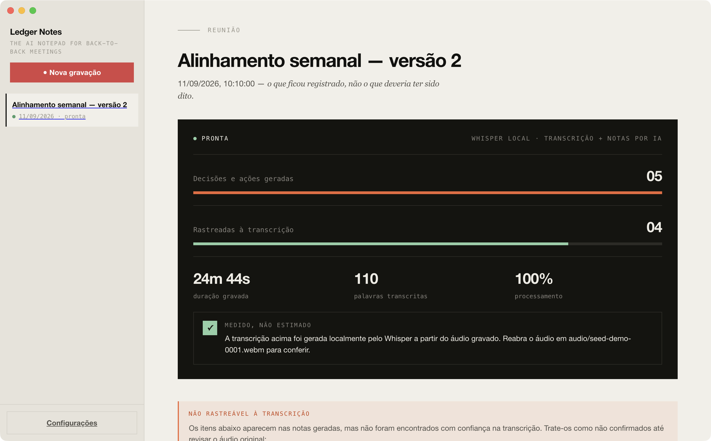

# Ledger Notes

**The AI notepad for back-to-back meetings.**



[**Download for Mac**](https://github.com/juliopessan/Ledger-Notes/releases/latest) · [Landing page](https://juliopessan.github.io/Ledger-Notes/)

A local-first AI meeting notepad inspired by [Granola](https://www.granola.ai/). The name comes from the design system the UI is built on: the transcript is the *measured* claim (what was actually said), AI-generated notes are the *assertion* — and the interface never lets the two look alike.

- Records mic + system audio (the whole call, not just your voice)
- Transcribes locally with [faster-whisper](https://github.com/SYSTRAN/faster-whisper) — audio never leaves your machine
- Generates structured notes (summary, decisions, action items) using Claude or GPT — bring your own API key
- No API key configured? It still produces basic notes via a local heuristic (extracted straight from the transcript, never invented) instead of blocking you
- Flags any note item that couldn't be matched back to the transcript (a lightweight hallucination check), using the **Ledger** design system: mint = traced to the transcript, clay = unconfirmed

## Getting started

```bash
npm install
```

Transcription runs in a Python sidecar (`faster-whisper`) spawned by the Electron main process. Set it up once:

```bash
cd python
python3 -m venv .venv
source .venv/bin/activate
pip install -r requirements.txt
cd ..
```

Then:

```bash
npm run dev
```

On the first transcription, the Whisper model you picked in Settings downloads automatically (a few minutes, depending on the model size).

## Configuration

1. Open **Settings** in the app.
2. (Optional) Pick an AI provider for notes (Anthropic or OpenAI) and paste your API key — without one, the app still works with locally-generated heuristic notes.
3. Pick the Whisper model (`small` is a good speed/accuracy balance) and the transcription language.

## macOS permissions

To capture system audio (the other participants on the call), macOS asks for **Screen Recording** permission the first time — go to System Settings → Privacy & Security → Screen Recording and enable the app.

## Building for distribution

```bash
npm run dist:mac
```

Produces an unsigned `.dmg` for Apple Silicon in `dist/`. The `python/` sidecar script is bundled into the app's resources, and at runtime the app resolves a Python interpreter in this order: the path set in Settings → a `.venv` next to the bundled script → a system `python3` (Homebrew, `/usr/local`, `/usr/bin`). That interpreter still needs `faster-whisper` installed.

**Two caveats for anyone installing the packaged build:**

- It is **not signed or notarized** — signing requires a paid Apple Developer ID. On first launch macOS will refuse to open it; right-click the app → Open → Open to get past Gatekeeper.
- Python with `faster-whisper` must be present on the machine for transcription to work. Bundling a self-contained Python runtime (e.g. [python-build-standalone](https://github.com/indygreg/python-build-standalone) or a PyInstaller build of `python/transcribe.py`) is still open.

## Landing page

`docs/index.html` is a static landing page, served by GitHub Pages from the `main` branch `/docs` folder. Nothing to build — open the file, or serve the folder:

```bash
python3 -m http.server 4173 --directory docs
```

## Architecture

- `src/main` — Electron main process: storage (local JSON in `~/Library/Application Support/ledger-notes`), transcription (ffmpeg + the `faster-whisper` Python sidecar), note generation (Anthropic/OpenAI SDK, with a local heuristic fallback)
- `python/transcribe.py` — standalone Python script that runs `faster-whisper` over a WAV file and prints `{"text": "..."}` to stdout; invoked via `child_process.spawn` from the main process
- `src/preload` — the `contextBridge` bridge between main and renderer
- `src/renderer` — React UI, built on the Ledger design system (`src/renderer/src/styles.css`)
- `src/shared/types.ts` — types shared across all three processes

## Known limitations (MVP)

- Transcription runs after the recording ends (not live, word-by-word)
- Storage is a single JSON file — fine for dozens/hundreds of meetings; migrate to SQLite if volume grows a lot (see the SQLite note below)
- The "untraceable items" check is a simple word-overlap heuristic, not a semantic check
- The no-AI fallback (local heuristic) produces simpler notes than a language model would — key points are sentences sampled from the transcript, not a real synthesis
- The packaged build (`dist:mac`) doesn't yet bundle a relocatable Python runtime, and isn't code-signed — see "Building for distribution" above

## A note on SQLite

The project uses JSON file storage (`src/main/db.ts`) instead of `better-sqlite3` because this machine's Xcode Command Line Tools had corrupted receipts at the time the project was created, blocking the native module build. To migrate to SQLite:

```bash
sudo rm -rf /Library/Developer/CommandLineTools
xcode-select --install
```

Then `npm install better-sqlite3 @types/better-sqlite3` and rewrite `src/main/db.ts`, keeping the same public API (`createMeeting`, `updateMeeting`, `getMeeting`, `listMeetings`, `deleteMeeting`).

## Credits

The choice of `faster-whisper` as the local transcription engine, and the no-API-key heuristic fallback pattern, were inspired by the architecture of [sessao-star](https://github.com/juliopessan/sessao-star), another local-first project by the same author.
